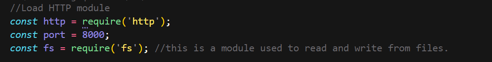
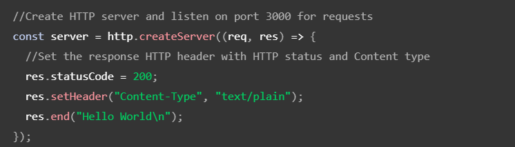
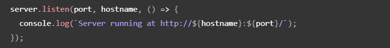
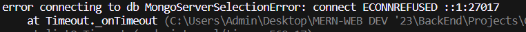

# BackEnd Using Node.js , Express and Mongo

Node.js isan open-source, cross-platform, single-threaded JavaScript runtime environment for building fast and scalable server-side and networking applications. It runs on the V8 JavaScript runtime engine and uses an event-driven, non-blocking I/O architecture, making it efficient and suitable for real-time applications.

NodeJS file extension is in JavaScript. (.js)

## V8 Engine

V8 is the name of the JavaScript engine that powers Google Chrome. It's the thing that takes our JavaScript and executes it while browsing with Chrome. V8 provides the runtime environment in which JavaScript executes. The DOM and the other Web Platform APIs are provided by the browser.

V8 is written in C++, and it's continuously improved. It is portable and runs on Mac, Windows, Linux and several other systems.

## Command Line Arguments

Command-line arguments are the values given after the name of the program in the command-line shell of Operating Systems. Command-line arguments are handled by the main() function of a C/C++ program.

### Syntax

```
int main(int argc, char *argv[]) { /* ... */ }
            or
int main(int argc, char **argv) { /* ... */ }
```

Here,

* **argc (ARGument Count)** is an integer variable that stores the number of command-line arguments passed by the user including the name of the program. So if we pass a value to a program, the value of argc would be 2 (one for argument and one for program name)
* The value of argc should be non-negative.
* **argv (ARGument Vector)** is an array of character pointers listing all the arguments.
* If argc is greater than zero, the array elements from argv[0] to argv[argc-1] will contain pointers to strings.
* argv[0] is the name of the program , After that till argv[argc-1] every element is command -line arguments.

### Properties

1. They are passed to the main() function.
2. They are parameters/arguments supplied to the program when it is invoked.
3. They are used to control programs from outside instead of hard coding those values inside the code.
4. argv[argc] is a NULL pointer.
5. argv[0] holds the name of the program.
6. argv[1] points to the first command line argument and argv[argc-1] points to the last argument.

## Creating First Server

### Steps for starting a basic server

1. Load http module :

   
2. Create HTTP server and listen on port 3000 for requests:

   
3. Listen for requests on port 3000, and as a cakkback function, have the port listened on logged.

   

### Status Code for HTTP responses

Status code are returned for every request which is made to the server as a response.
Read more [here](https://developer.mozilla.org/en-US/docs/Web/HTTP/Status)

### NodeMon

nodemon is a tool that helps develop Node.js based applications by automatically restarting the node application when file changes in the directory are detected.

nodemon does **not** require *any* additional changes to your code or method of development. nodemon is a replacement wrapper for `node`. To use `nodemon`, replace the word `node` on the command line when executing your script.

#### Installation

Either through cloning with git or by using [npm](http://npmjs.org/) (the recommended way):

```shell
npm install -g nodemon # or using yarn: yarn global add nodemon
```

And nodemon will be installed globally to your system path.

You can also install nodemon as a development dependency:

```shell
npm install --save-dev nodemon # or using yarn: yarn add nodemon -D
```

#### Usage

nodemon wraps your application, so you can pass all the arguments you would normally pass to your app:

```shell
nodemon [your node app]
```

### MongoDB and Mongoose

#### Installations and SetUp

To install and set-up MongoDB connection, install MongoDB at: [HERE](https://www.mongodb.com/)

If you install MongoDB with version higher than 6.0 then follow this steps to install[ Mongo and start server](https://www.youtube.com/watch?v=59Yhxwdgi7I&lc=Ugz0Ke0jiT9SMY-w6214AaABAg).

Mongoose Install

```
npm install mongoose
```

Note: If you encounter this error:



 Solution: Instead connecting database like:

```
mongoose.connect('mongodb://localhost/Contact_listDB');
```

Connect it in this manner:

```
mongoose.connect('mongodb://127.0.0.1:27017/Contact_listDB');
```

Know more about mongoose: [OFFCIAL DOCUMENTATION](https://mongoosejs.com/docs/index.html)

### What is __v in mongoose?

The `versionKey` is a property set on each document when first created by Mongoose. This keys value contains the internal [revision](http://aaronheckmann.blogspot.com/2012/06/mongoose-v3-part-1-versioning.html) of the document. The `versionKey` option is a string that represents the path to use for versioning. The default is `__v`.

## Some Backend Code Concepts in Express: 

How to use the req Object in Express: [Here](https://www.digitalocean.com/community/tutorials/nodejs-req-object-in-expressjs)
