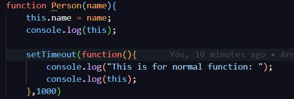
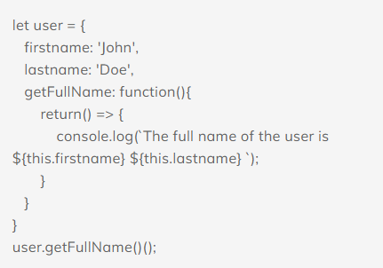

# Function Binding in JS

When passing object methods as callbacks, for instance to `setTimeout`, there’s a known problem: "losing `this`".



### Losing "this"

he method `setTimeout` in-browser is a little special: it sets `this=window` for the function call (for Node.js, `this` becomes the timer object, but doesnt really matter here). So for `this.firstName` it tries to get `window.firstName`, which does not exist. In other similar cases, usually `this` just becomes `undefined`.


### Solution 1: Using Arrow Function (=>)


## Example for Bound and Unbound Function: 


**Solution:** 

```
In the given example, the function which is getting returned i.e.
  
    return function(){

           console.log(`The full name of the user is ${this.firstname} ${this.lastname} `);
     }
Is a unbounded function (An unbound function is a function that is not bound to an object) So this in the above function refers to the global (window) object. Since unbound functions are implicitly bound to the global scope). And since no firstname and lastname variables were defined in the window environment,  ${this.firstname} ${this.lastname}  prints undefined undefined.
```




**Solution:** 

```
ES6 arrow functions can’t be bound to a this keyword, so it will lexically go up a scope, and use the value of this in the scope in which it was defined.
Hence this refers to the user object in this case and thus ${this.firstname} ${this.lastname} will print John Doe.
```
