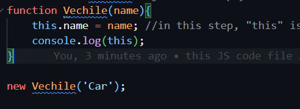
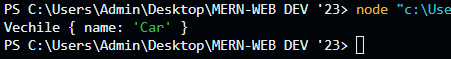
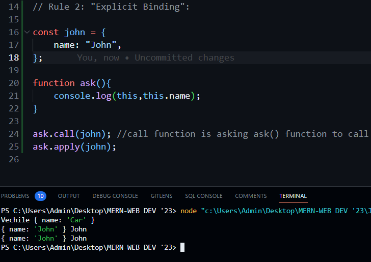
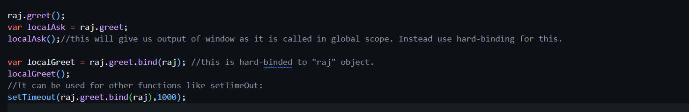

# this Keyword

 A function's this keyword behaves a little differently in JavaScript compared to other languages. It also has some differences between strict mode and non-strict mode.

In most cases, the value of `this` is determined by how a function is called (runtime binding). It can't be set by assignment during execution, and it may be different each time the function is called.

There are 4 rules/concepts to find out the value of "this", as function declaration is done in 4 ways only.

## 1st Rule "new" keyword

#### What is the ‘new’ keyword primarily used for?


```
The ‘new’ keyword creates a new instance of an object from a function. The variables defined inside the function (using this.varName) are properties of the object. This object becomes the value of ‘this’ inside the function’s execution context. But primarily, the ‘new’ keyword is used to create a new instance of an object from a function (called a constructor function).
```


1. How does it works:
   1.1 "new" keyword create new Object { }.
   1.2 This { } is linked to Vechile.prototype
   1.3  Vechile( ) function is called and this is assigned the object.
   1.4 If the function returns nothing, it returns { }.

eg:

  

 Output: 


## 2nd Rule "Explicit Binding Rule"

This explicit binding allows us to tell JS what object we want to call inside function.call(object) and function.apply(object).




* Hard-Binding in Js:

  
