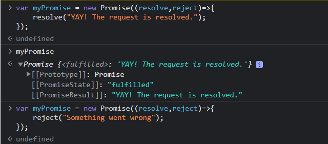
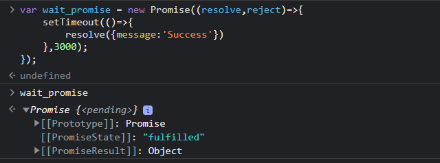
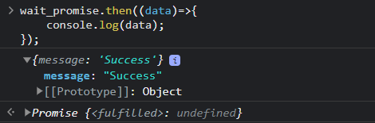
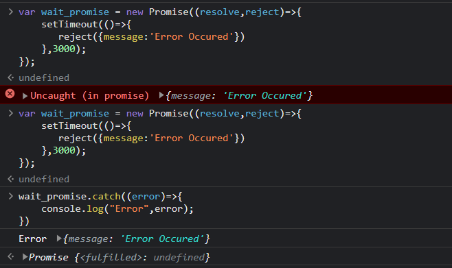
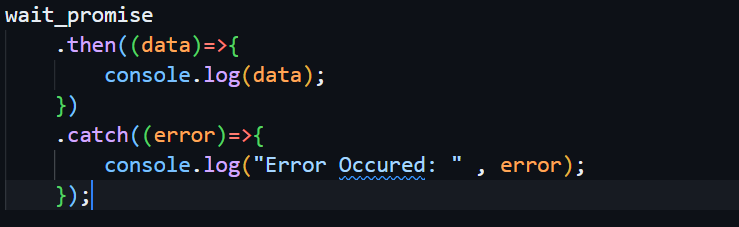
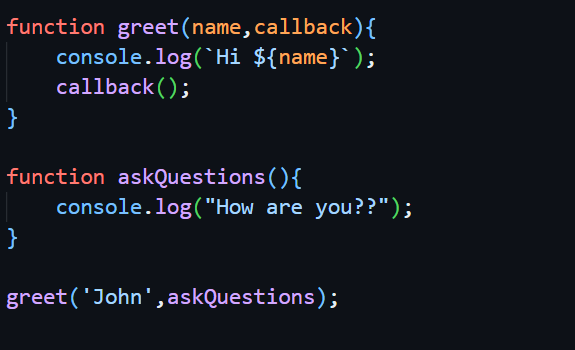
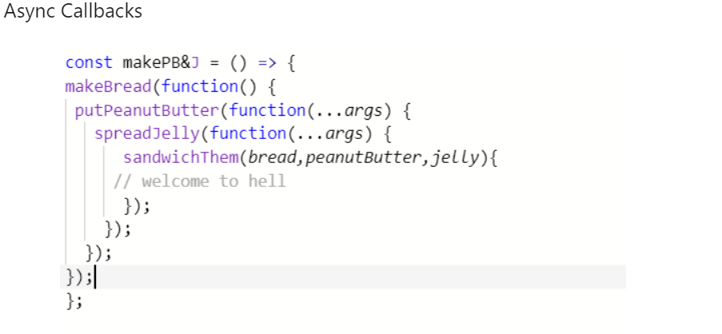
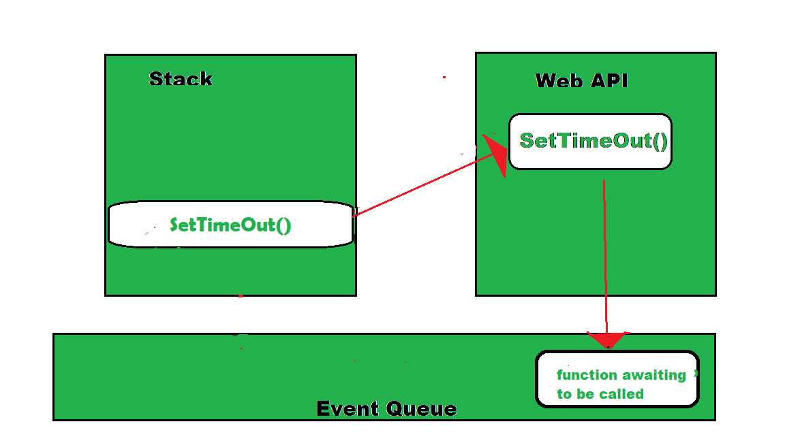
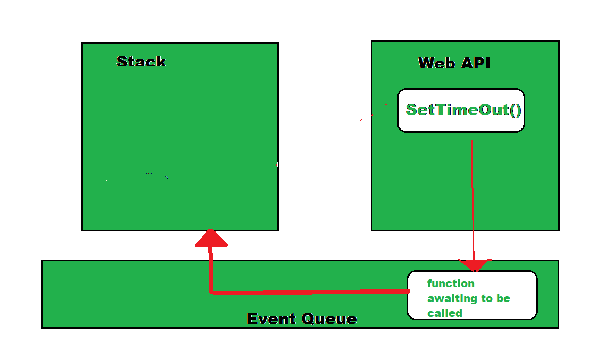
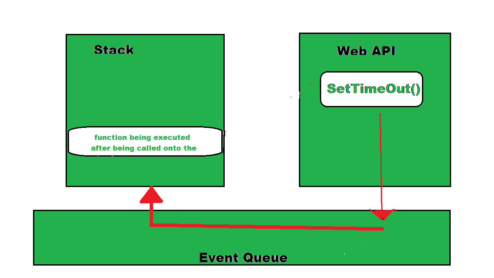

# Asynchronous Javascript Concepts:

## Promises

### Theory

The Promise object represents the eventual completion (or failure) of an asynchronous operation and its resulting value.

* A Promise is in one of these states:

  pending: initial state, neither fulfilled nor rejected.

  fulfilled: meaning that the operation was completed successfully.

  rejected: meaning that the operation failed.

### Examples with JS Codes

* Wait() function using promises and setTimeOut() :   [Leetcode Question]

  
* ".then" and ".catch" function:

  "then" Keyword is called when ever the promise is full filled.

  "Catch"  Keyword is called when ever the promise is rejected and we also get the error reason.
  Together they act as a if-else condition for status of promise.

  

  

## Callbacks

### Theory

A **callback function** is a function passed into another function as an argument, which is then invoked inside the outer function to complete some kind of routine or action.

JS is synchronous and single-threaded language. We use setTimeout() to perform Asynchrnous operations. In setTimeOut(), the callback function is function() we passed is a callback.

eg:

 

### Call Back Hell

This is a big issue caused by coding with complex nested callbacks. Here, each and every callback takes an argument that is a result of the previous callbacks. In this manner, The code structure looks like a pyramid, making it difficult to read and maintain. Also, if there is an error in one function, then all other functions get affected.

eg:

How to escape Call Back Hell?

* JavaScript provides an easy way of escaping from callback hell. This is done by event queue and promises.
* **A promise is a returned object from any asynchronous function, to which callback methods can be added based on the previous function’s result.**
* Promises use .then() method to call async callbacks. We can chain as many callbacks as we want and the order is also strictly maintained.
* Promises use .fetch() method to fetch an object from the network. It also uses .catch() method to catch any exception when any block fails.
* So these promises are put in the event queue so that they don’t block subsequent JS code. Also once the results are returned, the event queue finishes its operations.
* There are also other helpful keywords and methods like async, wait, set timeout() to simplify and make better use of callbacks.

## Task Queues, Micro-Task Queues and Event Loop:

### Event Loop

#### Definition

JavaScript has a runtime model based on an  **event loop** , which is responsible for executing the code, collecting and processing events, and executing queued sub-tasks. This model is quite different from models in other languages like C and Java.

An event loop is something that pulls stuff out of the queue and places it onto the function execution stack whenever the function stack becomes empty.

#### Working of Event Loop:

Here the callback function in the event queue has not yet run and is waiting for its time into the stack when the SetTimeOut() is being executed and the Web API is making the mentioned wait. When the function stack becomes empty, the function gets loaded onto the stack as shown below:

That is where the event loop comes into the picture, it takes the first event from the Event Queue and places it onto the stack i.e. in this case the callback function. From here, this function executes calling other functions inside it, if any.

